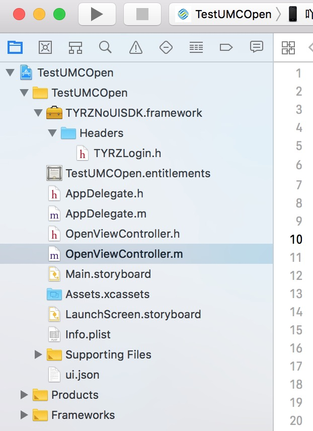
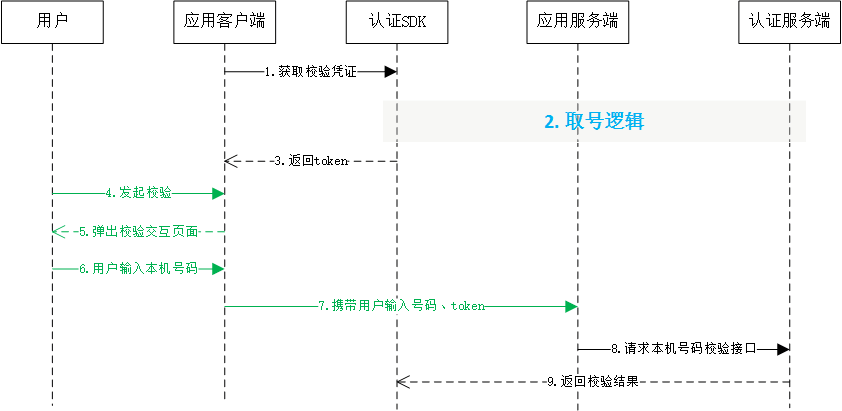

# 1. 开发环境配置 

sdk技术问题沟通QQ群：609994083

**注意事项：**

1. **认证取号服务必须打开蜂窝数据流量并且手机操作系统给予应用蜂窝数据权限才能使用**
2. **取号请求过程需要消耗用户少量数据流量（国外漫游时可能会产生额外的费用）**
3. **认证取号服务目前仅支持中国移动2/3/4G**

## 1.1. 环境配置及发布

1. 导入统一认证framework

直接将统一认证`TYRZNoUISDK.framework`拖到项目中



2. 在Xcode中找到`TARGETS-->Build Setting-->Linking-->Other Linker Flags`在这选项中需要添加`-ObjC`


## 1.2. Hello 统一认证 

本节内容主要面向新接入统一认证的开发者，介绍快速集成统一认证的基本服务的方法。

### 1.2.1. 统一认证登录流程



由流程图可知，业务客户端集成SDK后只需要完成2步集成实现登录

1. 调用SDK方法来获得token；
2. 携带token通过业务服务端到认证服务端的本机号码校验接口，进行号码校验

### 1.2.2. 统一认证登录集成步骤

**第一步：**

初始化代码只需要执行一次就可以。

```objective-c
self.login = [TYRZLogin loginWithAppId:APPID appKey:APPKEY];
```

**第二步：**

在需要用到登录的地方调用登录接口即可，以下是登录示例

```objective-c
- (void)showImplicitLogin {
    [self.login requestTokenWithTimeout:8000 Complete:^(NSDictionary * _Nonnull    loginResponse) {

        weakself.maskView.hidden = YES;
        [weakself.indicatorView stopAnimating];

        NSString *resultCode = loginResponse[@"resultCode"];
        weakself.token = loginResponse[@"token"];
        NSMutableDictionary *result = [NSMutableDictionary dictionaryWithDictionary:loginResponse];
        if ([resultCode isEqualToString:CLIENTSUCCESSCODECLIENT]) {
            result[@"result"] = @"获取token成功";
        } else {
            result[@"result"] = @"获取token失败";
        }
        [weakself showInfo:result];
    }];
}
```

<div STYLE="page-break-after: always;"></div>

# 2. SDK方法描述
## 2.1. 获取校验凭证

### 2.1.1 方法描述

开发者向统一认证服务器获取临时凭证`token`。</br>

</br>

**原型**

`TYRZLogin -> requestTokenWithTimeout`

```objective-c
- (void)requestTokenWithTimeout:(NSTimeInterval)duration Complete:(void(^)(NSDictionary *))complete;
```

### 2.1.2 参数说明

**请求参数**

| 参数       | 类型            | 是否必填 | 说明              |
| -------- | ------------- | ---- | --------------- |
| duration    | NSTimeInterval     | 是    | 请求时间  |
| complete | UAFinishBlock | 是    | 登录回调            |


**响应参数**


| 参数          | 类型         | 说明                                       |
| ----------- | ---------- | ---------------------------------------- |
| resultCode  | NSUinteger | 返回码       |
| token       | NSString   | 成功时返回：临时凭证，token有效期2min，一次有效，同一用户（手机号）10分钟内获取token且未使用的数量不超过30个 |
| resultDesc        | NSString   | 返回码描述                                |


### 2.1.3 示例

**请求示例代码**


```objective-c
/**
 获取token
 */
 - (IBAction)loginimplicit:(id)sender {
 
    self.maskView.hidden = NO;
    [self.indicatorView startAnimating];
    typeof(self) weakself = self;
 
    [self.login requestTokenWithTimeout:8000 Complete:^(NSDictionary * _Nonnull loginResponse) {
 
        weakself.maskView.hidden = YES;
        [weakself.indicatorView stopAnimating];
 
        NSString *resultCode = loginResponse[@"resultCode"];
        weakself.token = loginResponse[@"token"];
        NSMutableDictionary *result = [NSMutableDictionary dictionaryWithDictionary:loginResponse];
        if ([resultCode isEqualToString:CLIENTSUCCESSCODECLIENT]) {
            result[@"result"] = @"获取token成功";
        } else {
            result[@"result"] = @"获取token失败";
        }
        [weakself showInfo:result];
 }];
 
 }
```


**响应示例代码**

```
{
    resultDesc = "";
    resultCode = 103000;
    token = STsid00000015087457254472qa7Mh1AAZH1U0xwvoMnKu5XxipjWXWE;
}
```

<div STYLE="page-break-after: always;"></div>

# 3. 平台接口说明

## 3.1. 本机号码校验接口

开发者获取token后，需要将token传递到应用服务器，由应用服务器发起本机号码校验接口的调用。

校验结果有两种：1.是本机号码；2.非本机号码。对于校验结果为**2.非本机号码**的请求，开发者可以选择使用短验辅助校验功能，通过短信验证码验证用户身份（**短验辅助校验无法保证校验的号码和本机号码一致**）

调用本接口，必须保证：

1. token在有效期内（2分钟）。
2. token还未使用过。
3. 应用服务器出口IP地址在开发者社区中配置正确。

对于本机号码校验，需要注意：

1. 本产品属于收费业务，开发者未签订服务合同前，每天总调用次数有限，详情可咨询商务。
2. 签订合同后，将不再提供每天免费的测试次数。

### 3.1.1. 接口说明

**调用次数说明：**本产品属于收费业务，开发者未签订服务合同前，每天总调用次数有限，详情可咨询商务。

**请求地址：** https://www.cmpassport.com/openapi/rs/tokenValidate

**协议：** HTTPS

**请求方法：** POST+json

</br>

### 3.1.2.  参数说明

1、json形式的报文交互必须是标准的json格式

2、发送时请设置content type为 application/json

3、参数类型都是String

**请求参数**

| 参数          | 层级  | 是否必填                     | 说明                                                         |
| ------------- | ----- | ---------------------------- | ------------------------------------------------------------ |
| **header**    | **1** | 是                           |                                                              |
| version       | 2     | 是                           | 版本号,初始版本号1.0,有升级后续调整                          |
| msgId         | 2     | 是                           | 使用UUID标识请求的唯一性                                     |
| timestamp     | 2     | 是                           | 请求消息发送的系统时间，精确到毫秒，共17位，格式：20121227180001165 |
| appId         | 2     | 是                           | 应用ID                                                       |
| **body**      | **1** | 是                           |                                                              |
| openType      | 2     | 否，requestertype字段为0时是 | 运营商类型：</br>1:移动;</br>2:联通;</br>3:电信;</br>0:未知  |
| requesterType | 2     | 是                           | 请求方类型：</br>0:APP；</br>1:WAP                           |
| message       | 2     | 否                           | 接入方预留参数，该参数会透传给通知接口，此参数需urlencode编码 |
| expandParams  | 2     | 否                           | 扩展参数格式：param1=value1\|param2=value2  方式传递，参数以竖线 \| 间隔方式传递，此参数需urlencode编码。 |
| keyType       | 2     | 否                           | 手机号码加密方式：</br>0:默认phonenum采用sha256加密，sign采用HMACSHA256算法</br>1:RSA加密（暂未支持）</br>（注：keyType=1时，phonenum和sign均使用RSA，keyType不填或非1、0时按keyType=0处理） |
| phoneNum      | 2     | 是                           | 待校验的手机号码的64位sha256值，字母大写。（手机号码 + appKey + timestamp， “+”号为合并意思）（注：建议开发者对用户输入的手机号码的格式进行校验，增加校验通过的概率） |
| token         | 2     | 是                           | 身份标识，字符串形式的token                                  |
| sign          | 2     | 是                           | 签名，HMACSHA256(appId + msgId + phonNum + timestamp + token + version)，输出64位大写字母 （注：“+”号为合并意思，不包含在被加密的字符串中,appkey为秘钥, 参数名做自然排序（Java是用TreeMap进行的自然排序）） |

**响应参数**

| 参数         | 层级  | 说明                                                         |
| ------------ | ----- | :----------------------------------------------------------- |
| **header**   | **1** |                                                              |
| msgId        | 2     | 对应的请求消息中的msgid                                      |
| timestamp    | 2     | 响应消息发送的系统时间，精确到毫秒，共17位，格式：20121227180001165 |
| appId        | 2     | 应用ID                                                       |
| resultCode   | 2     | 平台返回码                                                   |
| **body**     | **1** |                                                              |
| resultDesc   | 2     | 平台返回码                                                   |
| message      | 2     | 接入方预留参数，该参数会透传给通知接口，此参数需urlencode编码 |
| accessToken  | 2     | 使用短验辅助服务的凭证，当resultCode返回为001时，并且该appid在开发者社区配置了短验辅助功能时返回该参数。accessToken有效时间为5min，一次有效。 |
| expandParams | 2     | 扩展参数格式：param1=value1\|param2=value2  方式传递，参数以竖线 \| 间隔方式传递，此参数需urlencode编码。 |

</br>

### 3.1.3. 示例

**请求示例**

```
{
    "header":{
        "appId":"3000666666666",
        "timestamp":"20180104090953788",
        "version":"1.0",
        "msgId":"8ADFF305C7FCB3E1B1AECC130792FBD0"
    },
    "body":{
        "openType":"1",
        "token":"STsid0000001515028196605yc1oYNTuPlTlLT10AR3ywr2WApEq14JH",
        "sign":"227716D80112F953632E4AFBB71C987E9ABF4831ACDA5A7464E2D8F61F0A9477",
     "phoneNum":"38D19FF8CE10416A6F3048467CB6F7D57A44407CB198C6E8793FFB87FEDFA9B8",
        "requesterType":"0"
    }
}
```


**响应示例**

```
{
    "body":{
        "message":"",
        "resultDesc":"是本机号码"
    },
    "header":{
        "appId":"3000*****40",
        "msgId":"8ADFF305C7FCB3E1B1AECC130792FBD0",
        "resultCode":"000",
        "timestamp":"20180104090957277"
    }
}
```

<div STYLE="page-break-after: always;"></div>

## 3.2. 短信验证码下发接口

短验辅助功能勾选后，本机号码校验接口返回**非本机号码**时，可以凭accessToken调用本接口请求短信验证码（仅支持移动号码）

**调用注意事项：**

1. 使用该接口前，请开发者在开发者社区能力配置页面勾选上**【短验辅助功能】**（勾选后10分钟生效）
2. 只有在服务端返回校验成功，而且结果为**非本机号码**时，才能调用该接口
3. 本接口要求服务器IP地址白名单与本机号码校验配置的白名单相同
4. 下发频次限制：每个手机号码1次/min，10次/24 hour
5. 短验下发成功后，5min内有效

### 3.2.1. 业务流程


### 3.2.2. 接口说明

**接口方向：**

| 接口调用方 | 接口提供方     |
| ---------- | -------------- |
| 应用服务端 | 移动认证服务端 |

**请求地址： https://www.cmpassport.com/openapi/rs/sendsmscode**

**协议：** HTTPS

**请求方法：** POST+json

</br>

### 3.2.3. 参数说明

1、json形式的报文交互必须是标准的json格式

2、发送时请设置content type为 application/json

3、参数类型都是String

**请求参数：**

| 参数          | 是否必填 | 说明                                                         |
| ------------- | -------- | :----------------------------------------------------------- |
| msgId         | 是       | 使用UUID标识请求的唯一性                                     |
| systemTime    | 是       | 请求消息发送的系统时间，北京时间，东八区时间。精确到毫秒，共17位，格式：20121227180001165。 |
| version       | 是       | 版本号,初始版本号1.0,有升级后续调整                          |
| requesterType | 是       | 合作伙伴集成类型0：APP；1：WAP                               |
| appId         | 是       | 应用id                                                       |
| mobileNumber  | 是       | 加密手机号码，AES加密，秘钥为md5（appkey）                   |
| userIp        | 是       | 客户端IP                                                     |
| message       | 否       | 接入方预留参数，该参数会透传给通知接口，此参数需urlencode编码 |
| accessToken   | 是       | 临时凭证，要求：失效时间默认为5分钟，可配置                  |
| expandParams  | 否       | 扩展参数                                                     |
| sign          | 是       | 签名，MD5(msgId + systemTime + version + requesterType+ appId + mobileNumber + userIp + appkey)，输出32位小写字母，（注：“+”号为合并意思，不包含在被加密的字符串中，appkey为秘钥,   参数名做自然排序（Java是用TreeMap进行的自然排序）排序后对应顺序参数值拼接做md5） |

**响应参数：**

| 参数       | 说明                                                         |
| ---------- | ------------------------------------------------------------ |
| msgId      | 对应的请求消息中的msgId                                      |
| systemTime | 消息发送的系统时间，精确到毫秒，共17位，格式：20121227180001165 |
| message    | 接入方预留参数，该参数会透传给通知接口，此参数需urlencode编码 |
| resultDesc | 返回码描述                                                   |
| resultCode | 处理状态编码：</br>000:成功；</br>003:内部调用失败；</br>004:下发失败；</br>102:参数无效；</br>124:IP校验失败；</br>213:appId不存在；</br>302:签名校验失败；</br>303:解析参数错误；</br>999:系统错误； |

## 3.3. 短信验证码校验接口

短验辅助功能勾选后，本机号码校验接口返回“非本机号码”时，并且成功调用短信验证码下发接口成功让用户获取到验证码后，可以凭验证码调用本接口发起校验。

### 3.3.1. 业务流程


### 3.3.2. 接口说明

**接口方向：**

| 接口调用方 | 接口提供方     |
| ---------- | -------------- |
| 应用服务端 | 移动认证服务端 |

**请求地址：** https://www.cmpassport.com/openapi/rs/checksmscode

**协议：** HTTPS

**请求方法：** POST+json

</br>

### 3.3.3. 参数说明

1、json形式的报文交互必须是标准的json格式

2、发送时请设置content type为 application/json

3、参数类型都是String

**请求参数：**

| 参数          | 是否必填 | 说明                                                         |
| ------------- | -------- | ------------------------------------------------------------ |
| msgId         | 是       | 使用UUID标识请求的唯一性                                     |
| systemTime    | 是       | 请求消息发送的系统时间，北京时间，东八区时间。精确到毫秒，共17位，格式：20121227180001165。 |
| version       | 是       | 版本号,初始版本号1.0,有升级后续调整                          |
| requesterType | 是       | 合作伙伴集成类型0：APP；1：WAP                               |
| appId         | 是       | 应用id                                                       |
| mobileNumber  | 是       | 加密手机号码，AES加密，秘钥为appkey                          |
| userIp        | 是       | 客户端IP                                                     |
| smsCode       | 是       | 短信验证码                                                   |
| message       | 否       | 接入方预留参数，该参数会透传给通知接口，此参数需urlencode编码 |
| sign          | 是       | 签名，MD5(msgId + systemTime + version + requesterType + appId + mobileNumber+ userIp + appkey)，输出32位小写字母，（注：“+”号为合并意思，不包含在被加密的字符串中，appkey为秘钥,   参数名做自然排序（Java是用TreeMap进行的自然排序）） |

**响应参数：**

| 参数       | 说明                                                         |
| ---------- | ------------------------------------------------------------ |
| msgId      | 对应的请求消息中的msgId                                      |
| systemTime | 消息发送的系统时间，精确到毫秒，共17位，格式：20121227180001165 |
| message    | 接入方预留参数，该参数会透传给通知接口，此参数需urlencode编码 |
| resultCode | 处理状态编码：</br>000:短信验证成功 ；</br>003:内部调用失败；</br>004:校验失败；</br>005:验证码已失效，请重新获取；</br>102:参数无效；</br>124:IP校验失败；</br>213:appId不存在；</br>302:签名校验失败；</br>303:解析参数错误；</br>999:系统错误； |

# 4. 平台返回码说明

## 4.1. SDK返回码说明

| 返回码 | 返回码描述                       |
| ------ | -------------------------------- |
| 103000 | 成功                             |
| 200009 | Bundle ID校验失败                |
| 200011 | 不允许http请求                   |
| 200021 | 数据解析异常                     |
| 200022 | 无网络                           |
| 200023 | 请求超时                         |
| 200026 | 参数错误                         |
| 200027 | 蜂窝网络未开启或者蜂窝网络不稳定 |
| 200028 | 请求出错                         |
| 200029 | 请求出错,上次请求未完成          |
| 200030 | 没有初始化参数                   |
| 200047 | 网络异常                         |
| 200048 | 无SIM卡                          |
| 200050 | EOF异常，网络请求无数据流返回    |
| 200062 | 不支持联通号码                   |
| 200063 | 不支持电信号码                   |


## 4.2. 本机号码校验接口返回码

本返回码表仅针对`本机号码校验接口`使用

| 返回码 | 说明                                         |
| ------ | -------------------------------------------- |
| 000    | 是本机号码（纳入计费次数）                   |
| 001    | 非本机号码（纳入计费次数，允许使用短验辅助） |
| 002    | 取号失败                                     |
| 003    | 调用内部token校验接口失败                    |
| 004    | 加密手机号码错误                             |
| 102    | 参数无效                                     |
| 124    | 白名单校验失败                               |
| 302    | sign校验失败                                 |
| 303    | 参数解析错误                                 |
| 606    | 验证Token失败                                |
| 999    | 系统异常                                     |
| 102315 | 次数已用完                                   |


## 4.3. 短信验证码下发接口

| 返回码 | 返回码描述               |
| ------ | ------------------------ |
| 000    | 成功                     |
| 003    | 内部调用失败             |
| 004    | 下发失败                 |
| 102    | 参数无效                 |
| 124    | IP 校验失败              |
| 125    | 未有使用移动认证短信能力 |
| 213    | appId不存在              |
| 302    | 签名校验失败             |
| 303    | 解析参数错误             |
| 999    | 系统错误                 |

## 4.4. 短信验证码校验接口

| 返回码 | 返回码描述               |
| ------ | ------------------------ |
| 000    | 短信验证成功。           |
| 003    | 内部调用失败             |
| 004    | 校验失败                 |
| 005    | 验证码已失效，请重新获取 |
| 102    | 参数无效                 |
| 124    | IP 校验失败              |
| 125    | 未有使用移动认证短信能力 |
| 213    | appId不存在              |
| 302    | 签名校验失败             |
| 303    | 解析参数错误             |
| 999    | 系统错误                 |


# 5. Q&A常见问题

I、有关json形式报文发送为什么报参数解析错误
答:①json形式的报文交互必须是标准的json格式；②发送时请设置content type为 application/json

<div STYLE="page-break-after: always;"></div>
